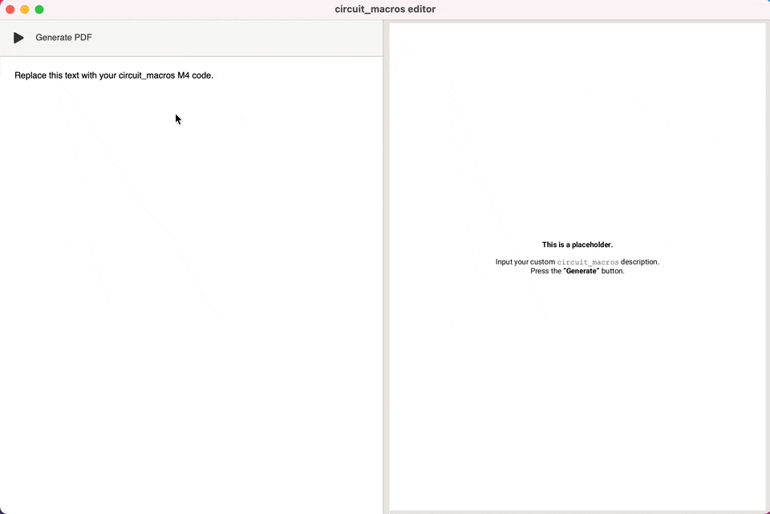

# circuitPreview
This tool requires various Python packages including PyLaTeX, Gi, and Evince.  The purpose of the tool is to write circuit_macros descriptions and immediately preview them, shortcutting the process of manually running commands and inserting into a LaTeX file to then compile and preview elsewhere.

It does nothing that a simple bash script couldn't do on its own.  I just added a GUI to experiment with Gtk.  All of the code was hastily written in a single Python file.  A few tester `.m4` files are provided.  The last file, `placeholder.pdf`, is what is rendered in the preview pane until a pass at generation is attempted.



**Needed updates:** remove dependencies, do not use shell behind the scenes, file browser / saving options, error previewing via a pop-up dialog box

-----

## Non-Python Dependencies

### Install dpic

Clone the dpic repository, and install by building from source

```
git clone https://gitlab.com/zyedidia/dpic/
cd dpic
./configure
sudo make install
```

Alternatively
```
git clone https://gitlab.com/aplevich/dpic
```
Then see Aplevich's `INSTALL` file.

---

### Install `circuit_macros`

Download the tar.gz file here https://ece.uwaterloo.ca/~aplevich/Circuit_macros/ or visit https://gitlab.com/aplevich/circuit_macros.  Untar it and place it somewhere on your computer. As an example, let's say you extract the files in the archive to the `~/circuit_macros` directory. Now add the following line to your `~/.bashrc` (or `~/.bash_profile` if on
MacOS).

```
export M4PATH=~/circuit_macros
```